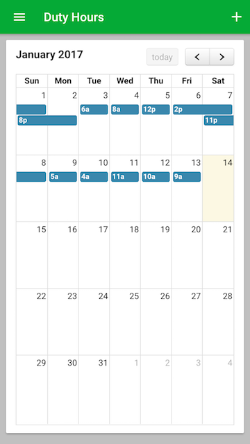
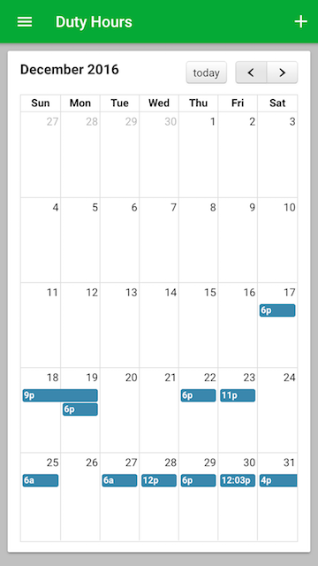
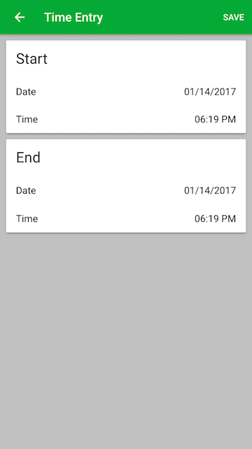
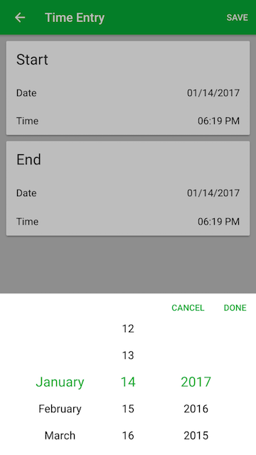
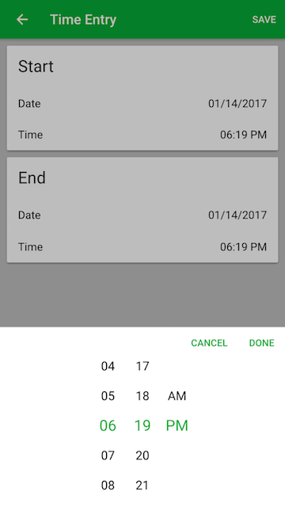
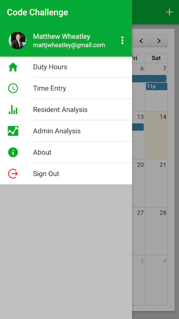
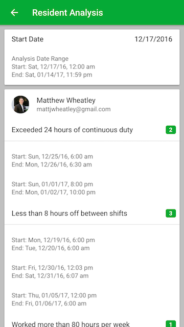
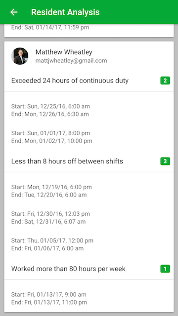
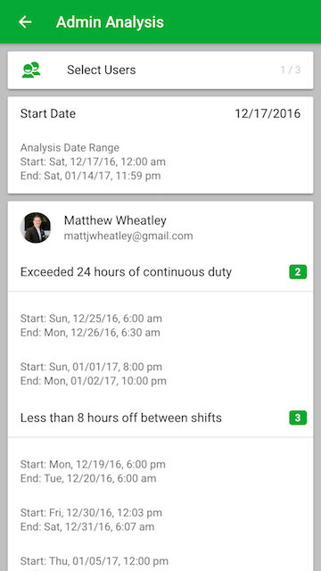
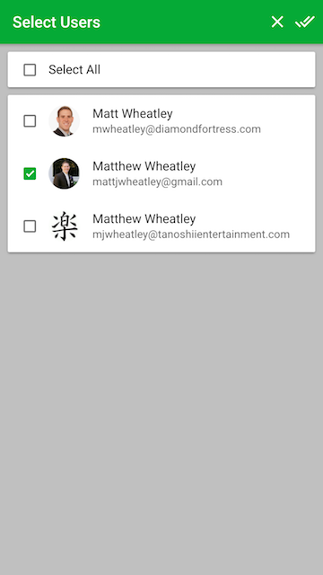

#Code Challenge - Response
###Create an account
* Click "Create Account"
    * Complete registration form
* Sign in with Google or Facebook

###Sample data
* The same sample data will be loaded for each user.

###View your duty hours on the calendar
* Click on a calendar event to open the "Time Entry" Page to view or edit your duty hours.
* Add new duty hours
    * Click the "+" button at the top right.
    * Open the menu and select "Time Entry".

###Resident Analysis
* Open the menu and select "Resident Analysis" to view your individual duty hour analysis.

###Admin Analysis
* Open the menu and select "Admin Analysis" to view a duty hour analysis for selected users.

##Screenshots
###Duty Hours
 
###Time Entry Page

####Date picker

####Time picker

###Menu

###Resident Analysis
 
###Admin Analysis

####Select Users

